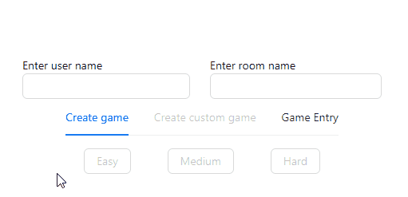
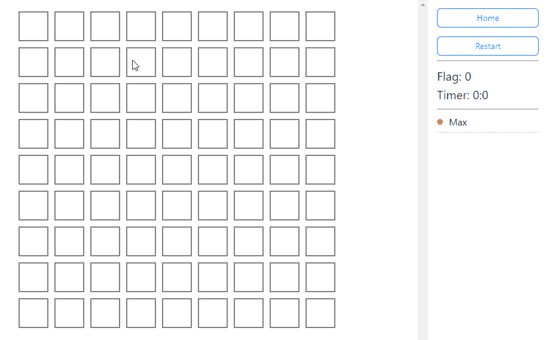
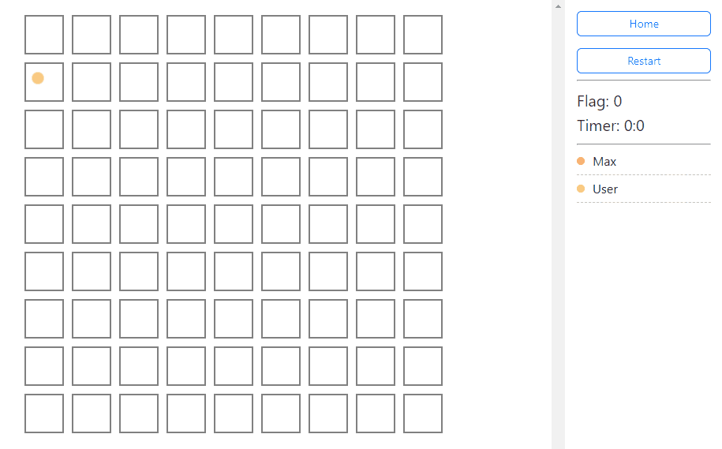
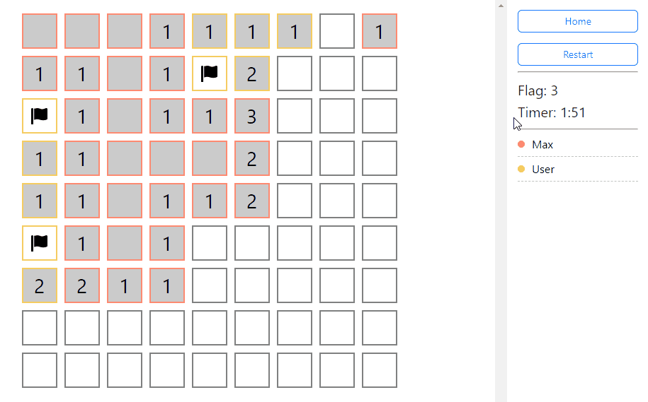

Moved frontend from repository [ktor-minesweeper](https://github.com/EvgeniyKu/ktor-minesweeper)

## Demo
[Link](http://5.187.4.192:12003/)

## Source server
[ktor-minesweeper](https://github.com/EvgeniyKu/ktor-minesweeper)

## Run: 
```
yarn dev
```

## Settings `.env`
Rename `example.env` to `.env`

Follow the instructions inside the file

## Overview

### Home page



### Game page



### Multiple players


### Player Cursors




### Highlight player cells


